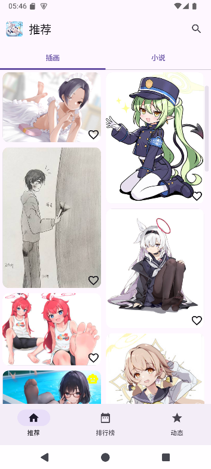

# Illustrations

## 1. Browsing

The illustration browsing page looks like this:

| PC                                                           | Phone                                                        |
| ------------------------------------------------------------ | ------------------------------------------------------------ |
|  |  |

- Click the heart shape to bookmark, click again to cancel
  
  > Long press the heart icon to bookmark by TAG, and set the category of the bookmark

- On desktop, press the `R` key or click the top button in the bottom right to return to the top, press `R` again to refresh.
  
  On mobile, click the top button to return to the top, pull down again to refresh.

- For PC shortcuts, please refer to [Shortcuts](docs/main/keyword.md)

- Click on an image to enter the illustration preview page. Click on the navigation bar to go to different modules.

> ### Special Illustration Markers
> 
> You may notice that during the illustration preview process, some markers appear in the upper right corner.
> 
> Below are the functions of these markers.
> 
> :::tip
> 
> The illustrations represented by these icons can be configured and filtered in the settings
> :::
> 
> | Icon                                                                       | Brief Introduction | Function                     |
> | ------------------------------------------------------------------------ | ---- | ---------------------- |
> |  | AI Generated | Indicates that this image was generated through AI. |
> |  | R18  | Indicates that this image contains adult content |
> |  | R18G | Indicates that this image contains grotesque or other elements not suitable for most viewers |
> 
> :::danger
> 
> When the R-18G icon appears, the R18 icon will also appear.
> 
> :::

## 2. Illustration Detail Page

The illustration detail page looks like this:

| PC                                                                       | Phone                                                                    |
| ------------------------------------------------------------------------ | ------------------------------------------------------------------------ |
|  |  |

### Illustration Images

Shows the various illustrations uploaded by the author. Illustrations exceeding three or more will be collapsed.

### Author Tags

Shows the author's username and bio. You can click on the author's avatar to enter their homepage.

Click the heart on the right to follow the author, long press to follow silently.

### Title and Description

Contains pid, title, and description.

Among them: pid and title can be clicked to copy, while the description can be long-pressed to select and copy.

The three icons on the right are for browsing, bookmarking, and downloading.

Among them: the effects of clicking and long-pressing the bookmark are the same as the operations on the browsing page.

Clicking download allows you to download the illustration.

### Comment Section

:::note

The comment section on mobile is folded in the side drawer and needs to be **swiped from the right side of the screen to the left** to properly pop up.

:::

1. Enter text in the input box and send to make a comment.
2. Click the pen/three-dot icon in the upper right corner to reply to someone's comment.
3. Click the arrow on the far left of the input box while in reply mode to exit reply mode.
