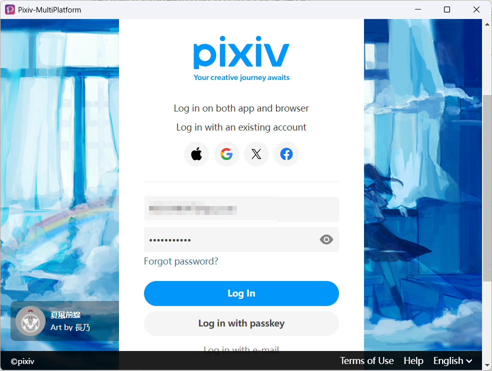
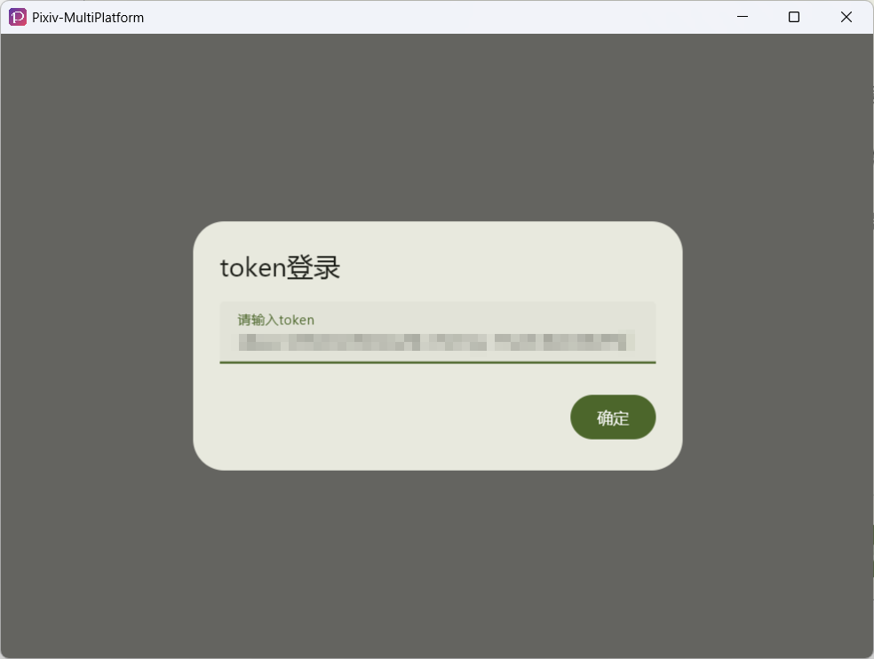
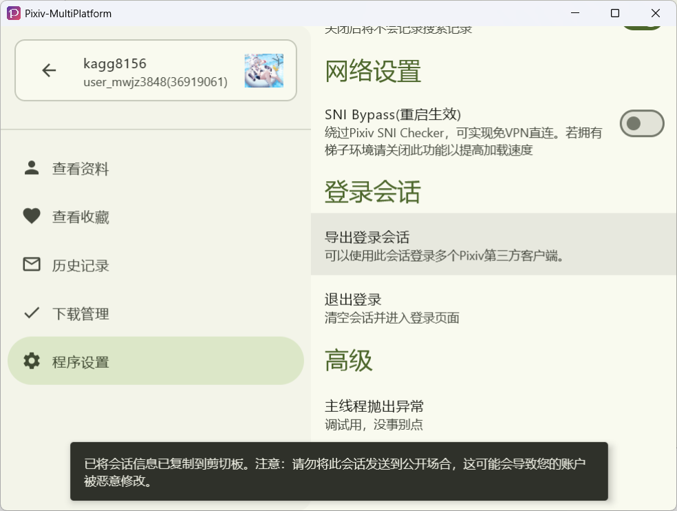

# Login

## Login Methods

Pixiv-MultiPlatform provides two login methods:

- [Using Embedded Browser Login](#using-embedded-browser-login)
- [Using Session Token Login (since 1.6.0)](#using-session-token-login)

## Using Embedded Browser Login

:::warning

To ensure UI logic consistency across all platforms, we use an embedded browser.

When using the software for the first time on desktop, you need to initialize the embedded browser, which will download **about 400MB** of browser core and decompress it.

On Android, you can log in directly.

:::

### 1. Preparation Before Login

- VPN or proxy tool. Since Pixiv uses oauth for login, and the verification code on the webpage makes simulating login API calls impractical, the only way is to open the embedded browser through a VPN and capture the login token.

  ::: tip

  Login and subsequent access can be done without a VPN, as we have measures to bypass blocks caused by external forces.
  :::

- A Pixiv account. If you don't have one, please [click this link](https://accounts.pixiv.net/signup) to register.

### 2. Login Steps

1. Click `Login with Embedded Browser` in the login wizard

   

2. Wait for the browser to load and display the Pixiv login page.

   

3. Enter your account and password, then click `Login In`. If the login is successful, the program will display the following prompt and enter the main page after three seconds.

   

### 3. Common Login Issues

#### 3.1 - Unable to Login with Google Account

Google banned login via embedded browsers in September 2023. For this situation, please use the username and password method to log in.

#### 3.2 - White Screen

Please check if your VPN or proxy software has been successfully enabled.

#### 3.3 - Unable to Initialize Embedded Browser (since V1.6.4)

So far, there has been [only one case](https://github.com/kagg886/Pixiv-MultiPlatform/issues/16) where the browser core could not be initialized. In the latest version, the following prompt will appear:


If you also encounter this problem, please check the following steps:

1. Is the firewall enabled?
   If enabled, please disable it.
   Or allow the `Pixiv-MultiPlatform` application (please search online for specific instructions on how to do this).
2. Can this URL be accessed normally: [https://d2xrhe97vsfxuc.cloudfront.net/jbr_jcef-21.0.6-windows-x64-b895.97.tar.gz](https://d2xrhe97vsfxuc.cloudfront.net/jbr_jcef-21.0.6-windows-x64-b895.97.tar.gz)?
   If not accessible, please initialize the embedded browser in a VPN environment.
3. Download the link mentioned in step `2`, then click the `Select Compressed Package Path` button, choose the `.tar.gz` file you just downloaded, and try again.
4. If it still fails, please click the link `Click this text to view detailed information`, take a screenshot of the content in the dialog box, and open the [Issue page](https://github.com/kagg886/Pixiv-MultiPlatform/issues/new?template=功能故障.md) to provide feedback.

## Using Session Token Login

::: tip

Please check if the version of Pixiv-MultiPlatform you downloaded is `1.6.0` or above. If it's below this version, you cannot use this method to log in.

:::

### 1. Preparation Before Login

- If you cannot access Pixiv from your region, please recall if you enabled the `SNI Bypass` feature in the welcome wizard.
   If you have enabled it, you do not need a VPN. If not, you need to enable a VPN.
- Don't have a login token but have logged in with other third-party Pixiv clients? Please refer to [How to Export Login Token](#3-how-to-export-login-token)

### 2. Login Steps

1. Click: `Login with Token`

   

2. In the dialog that appears next, paste your Token:

   

3. If the Token you entered is correct, after waiting for a while, you will see the following prompt. Three seconds later, you will enter the main page.

   

### 3. How to Export Login Token?

1. If you want to export the token from Pixiv-MultiPlatform, please go to the program settings, find `Export Login Session`, and click:

   

2. If you use other clients. After finding the session information exported by the client, you need to pay attention to fields such as `refresh_token`, the value of which is the login token needed by Pixiv-MultiPlatform.
   

   ::: danger 温馨提示

   Please do not paste the Cookie directly from the web page into the chat box! PMF only accepts login credentials from mobile devices!

   > #### What is a web page Cookie?
   >
   > It refers to a string similar to this that you copy from the developer tools:
   >
   > ```
   > p_ab_id=2; p_ab_id_2=8; p_ab_d_id=...; yuid_b=...; login_ever=yes; PHPSESSID=....; c_type=...; privacy_policy_notification=0; a_type=0; b_type=0; privacy_policy_agreement=7; __cf_bm=...; privacy_policy_agreement=7; cf_clearance=...
   > ```
   >
   > **Pay special attention not to fill in the PHPSESSID content into the dialog box!**

   :::