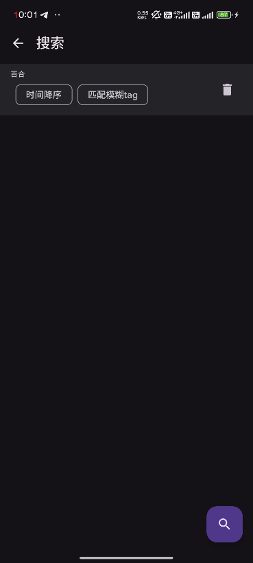
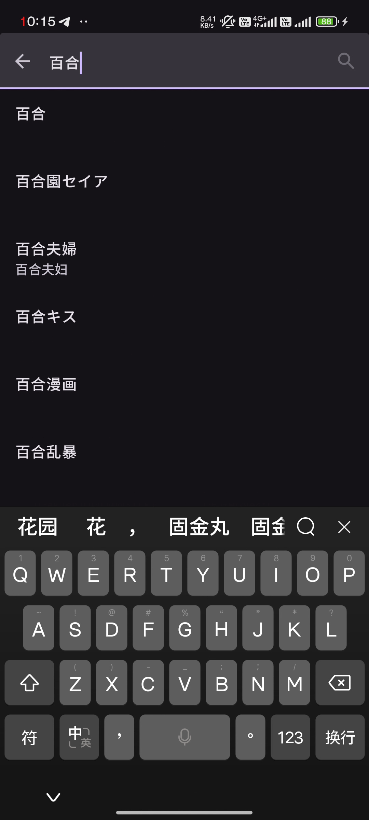

# Search

## How to Start Searching

Click the magnifying glass icon in the upper left corner (**upper right corner for Android**) of the home page to enter the search page.

| Desktop                                                                                            | Phone                                                                                              |
| -------------------------------------------------------------------------------------------------- | -------------------------------------------------------------------------------------------------- |
|  |  |

> The left shows a page with no history records, the right shows a page with history records.
> 
> Click the trash can icon to delete. Click on an entry to go to the TAG selection page.

Click the magnifying glass in the bottom right corner to start the formal search.

## Search Page

### Sort Methods

You can search using three methods: descending by time, ascending by time, and descending by popularity.

::: tip

For non-Pixiv Premium members, sorting by popularity in descending order will only return partial results.

Some situations do not support searching by these methods. In such cases, setting them will have no effect.

:::

### Search Modes

There are 5 search modes in total.

The first two search modes **require** searching by TAG.

The latter three search modes will not pop up the tag selection page.

Options with parentheses indicate that the search mode will only search for the options specified in the parentheses. For example:

The `Keyword` search mode only supports searching for novels.

### Popular Tags

Popular tags will load when you enter the page. Clicking these tags will directly fill the tag into the selection box above.

::: warning

When you click a tag, it will automatically change the search mode to: **Match Exact Tag**

:::

## Keyword Search for TAGs

Enter keywords in the input box to search. For example:

::: tip

Some TAGs will have corresponding Chinese names. Clicking these tags will still fill in the English keywords.

:::

After clicking on a tag, the tag will be filled into the input box above. Clicking the x on the right side of the tag will remove it.

## Special Search

We support pure numerical search for `Illustration/Novel(Series)/Author` links. Simply paste the corresponding ID in the input box.

Just find the result you like from the search results and click on it!

