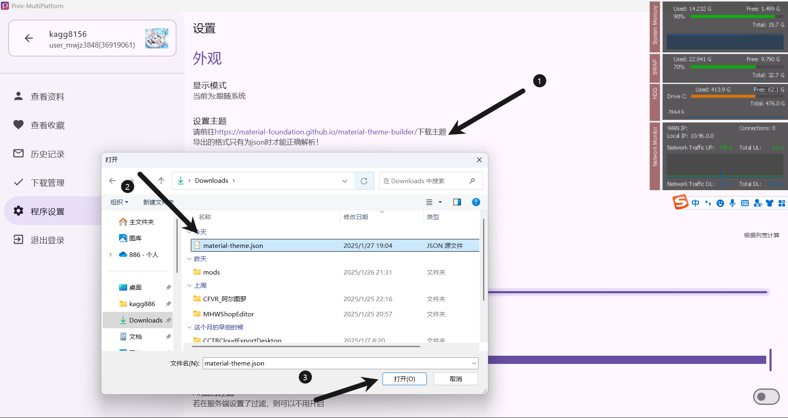
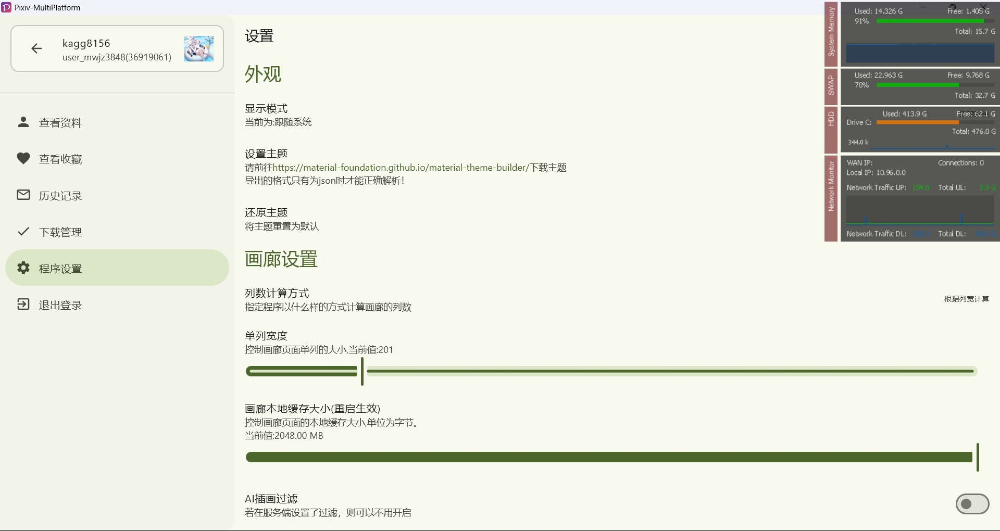

# Theme

## Day/Night Mode Theme Switching

Pixiv-MultiPlatform supports displaying night mode according to the system settings.

## Custom Themes

1. Open [Material Theme Builder](https://material-foundation.github.io/material-theme-builder/)

   

2. Configure your preferred colors
   

3. Click `Pick your fonts` in the lower right corner and then directly click `Export theme`

   

4. For export type, select `Material Theme(JSON)`

   

5. After successful export, open the software settings and click Import Theme.

   

6. Then, the theme is successfully switched! 