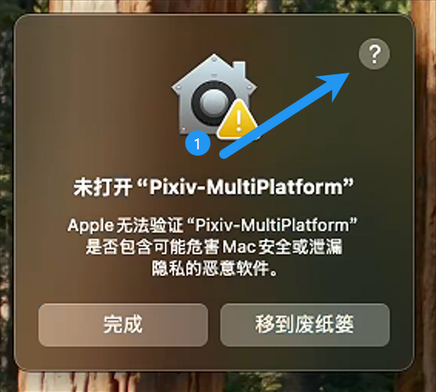
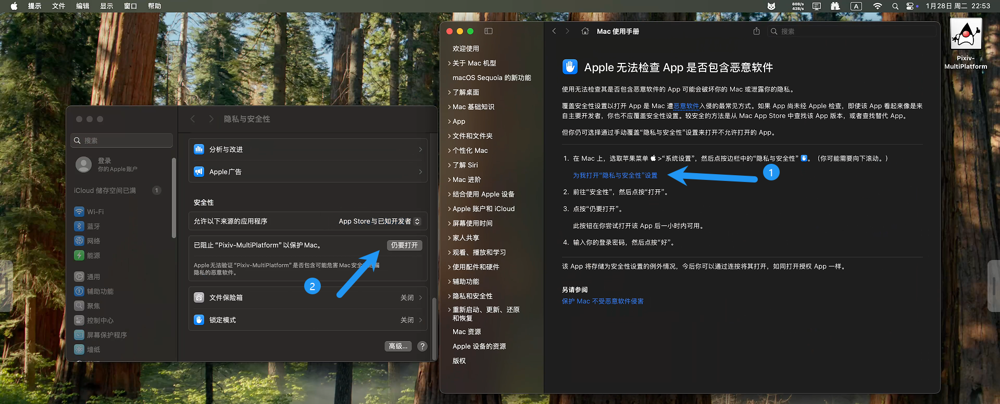

## 它兼容什么系统？

自1.6.0起，Pixiv-MultiPlatform支持下列操作系统

- Windows
- Linux
- macOS
- Android

::: tip

IOS的支持正在制作，敬请期待。

:::

## 我该如何选择安装包？

1. 点击[下载页面](https://github.com/kagg886/Pixiv-MultiPlatform/releases/latest)
2. Windows，Linux用户请跳转到[桌面端安装](#桌面端windowslinuxmacos安装)
3. Android用户请跳转到[安卓端安装](#安卓端安装)


## 桌面端(Windows，Linux,macOS)安装

1. 解压缩文件到你喜欢的位置中

2. Windows用户请寻找`Pixiv-MultiPlatform.exe`，Linux用户请寻找`Pixiv-MultiPlatform`

3. Linux用户需要赋予文件可执行权限。例如：

   ```bash
   chmod +x ./Pixiv-MultiPlatform
   ```

4. 双击可执行文件。

> ### macOS 上无法安装dmg文件的解决方案
>
> 1. 打开
>
>    
>
> 2. 依次点击
>
>    
>
> 3. 输入密码后，即可继续安装。

## 安卓端安装

1. 下载`android.apk`文件到你喜欢的位置中

   ::: info

   默认的存储位置应该是`内置存储/Downloads中`
   :::

2. 打开你手机里的文件管理软件(若没有请下载诸如`MT管理器`等的第三方文件管理工具)，找到你下载的`android.apk`。

3. 单击进行安装，安装时请留意：`无视风险`等小字。


## 卸载

安卓端请直接卸载，桌面端在删除文件夹后需要删除残留文件。

1. Windows的残留文件在`C:\Users\用户名\.config\pmf`中，直接拖进回收站即可。
2. Linux的残留文件在`~/.config/pmf`中，直接删除即可