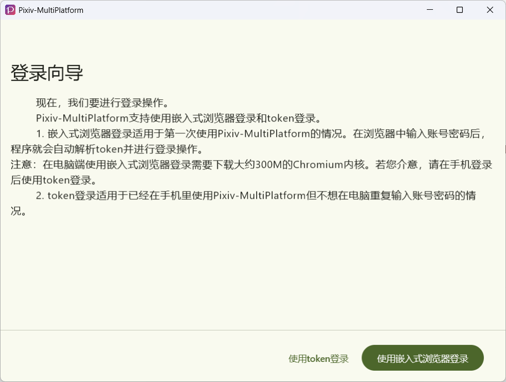
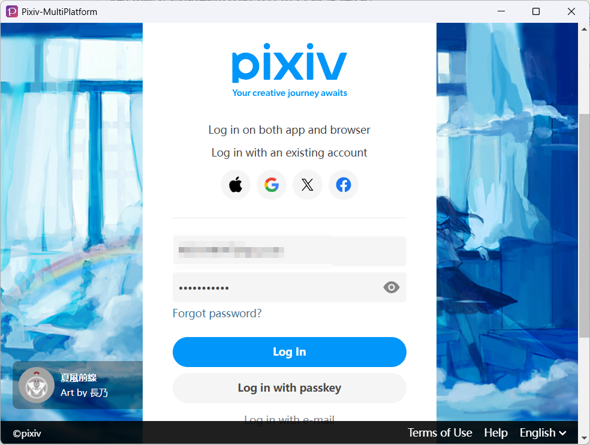
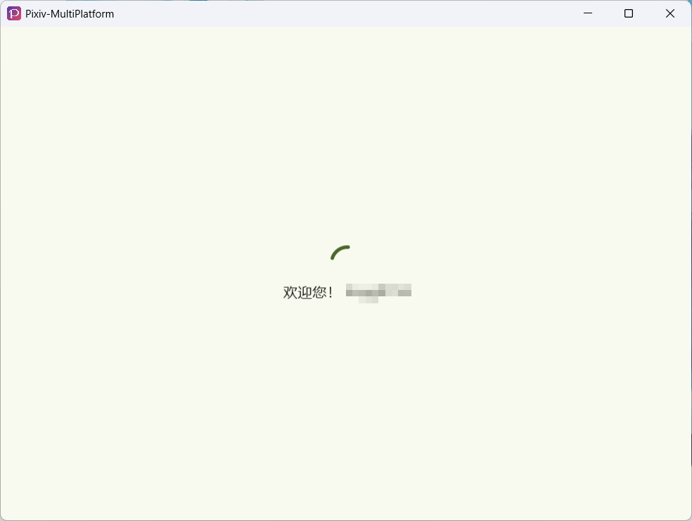
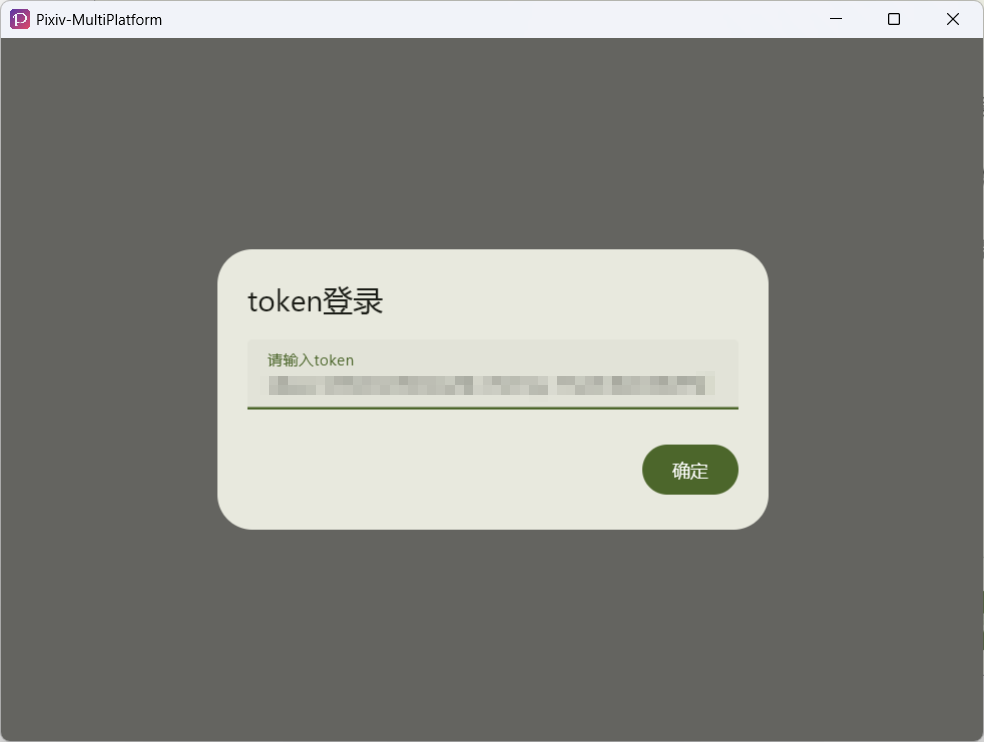
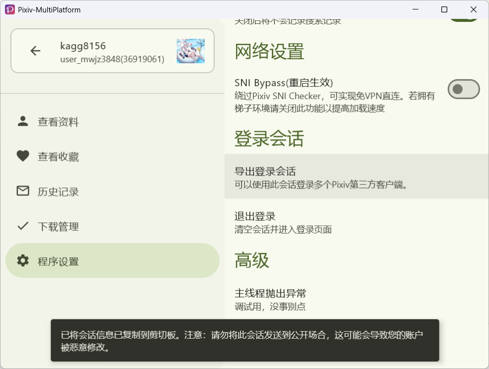

# 登录

## 登录方式

Pixiv-MultiPlatform提供了两种登录方式：

- [使用嵌入式浏览器登录](#使用嵌入式浏览器登录)
- [使用会话token登录(自1.6.0起)](#使用登录token登录)

## 使用嵌入式浏览器登录

:::warning

为保证软件在各个平台上的UI逻辑统一性，我们使用了嵌入式浏览器。

在桌面端首次使用软件时需要初始化嵌入式浏览器，它会下载**大约400MB**的浏览器内核并解压缩。

而在安卓端则可以直接登录。

:::

### 1. 登录前的准备

- 魔法上网工具。因为Pixiv使用oauth进行登录，而网页中存在的验证码使得模拟调用登录接口的方法不现实，因此只能通过魔法上网的方式打开嵌入式浏览器并抓取登录token。

  ::: tip

  登录及后续的访问可以不用魔法上网，我们有对应的措施来绕过不可抗力造成的封锁。
  :::

- 一个Pixiv账号，若没有的话请[点击此链接](https://accounts.pixiv.net/signup)进行注册。

### 2. 登录步骤

1. 在登录向导中点击`以嵌入式浏览器登录`

   

2. 等待浏览器加载并弹出pixiv登录网页。

   

3. 输入账号密码后，点击`Login In`。如果登录成功，则程序会弹出下面的提示后三秒，进入主页面

   

### 3. 登录的常见问题

#### 3.1 - 无法使用谷歌账号登录

谷歌在2023年9月禁止了在嵌入式浏览器中进行登录的途径。针对此种情况请使用账号密码的方式进行登录。

#### 3.2 - 白屏

请检查魔法上网软件是否成功开启。

## 使用登录Token登录

::: tip

请检查您下载的Pixiv-MultiPlatform版本是否为`1.6.0`及以上。低于此版本则无法使用此类方式进行登录。

:::

### 1. 登录前的准备

- 如果您所在的地区无法访问Pixiv，则请回忆您是否在欢迎向导中启用了`SNI Bypass`功能。
  如果您开启了，则不需要魔法上网。若未开启，则需要开启魔法上网。
- 没有登录token但是登录了其他第三方pixiv客户端？请参考[我该如何导出登录Token](#3-我该如何导出登录token)

### 2. 登录步骤

1. 点击：`使用Token登录`

   

2. 在接下来的对话框中粘贴您的Token：

   

3. 如果您输入的Token正确。在等待一会后，会出现如下提示。三秒后进入主页面。

   

### 3. 我该如何导出登录Token？

1. 如果您要从Pixiv-MultiPlatform导出token，请前往程序设置，找到`导出登录会话`后点击：

   

2. 如果您使用其他客户端。在找到客户端导出的会话信息后，需要重点关注诸如`refresh_token`的字段，其中的值便是Pixiv-MultiPlatform需要的登录token。