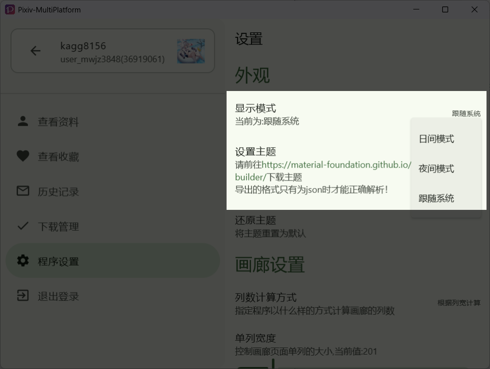
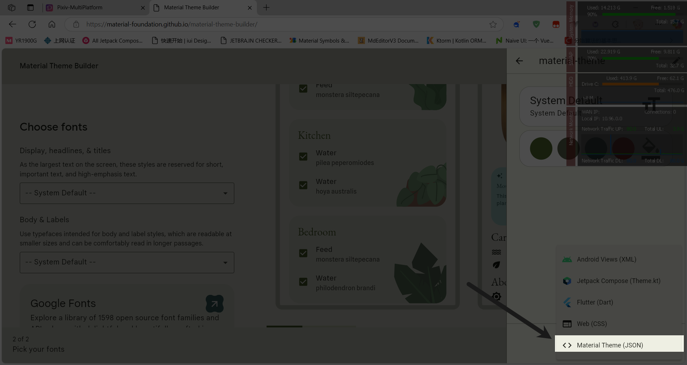
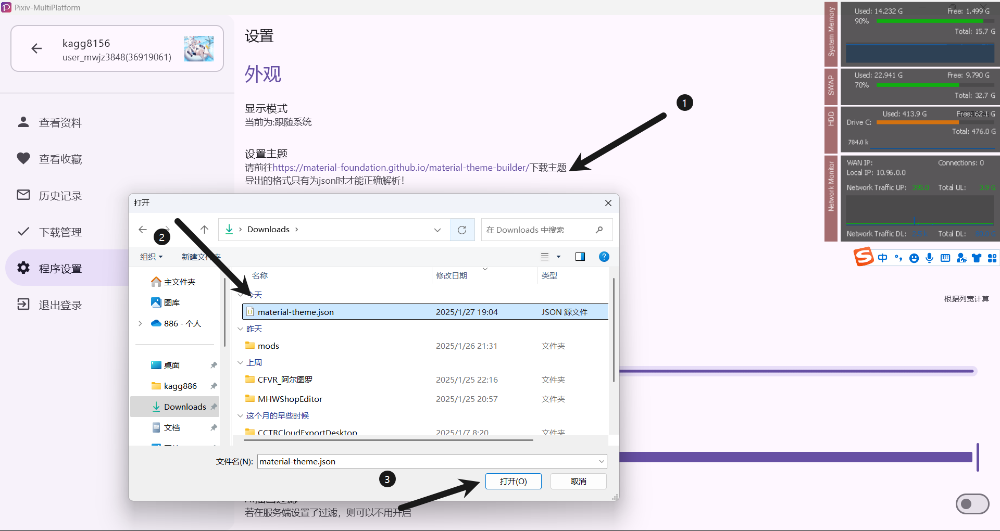
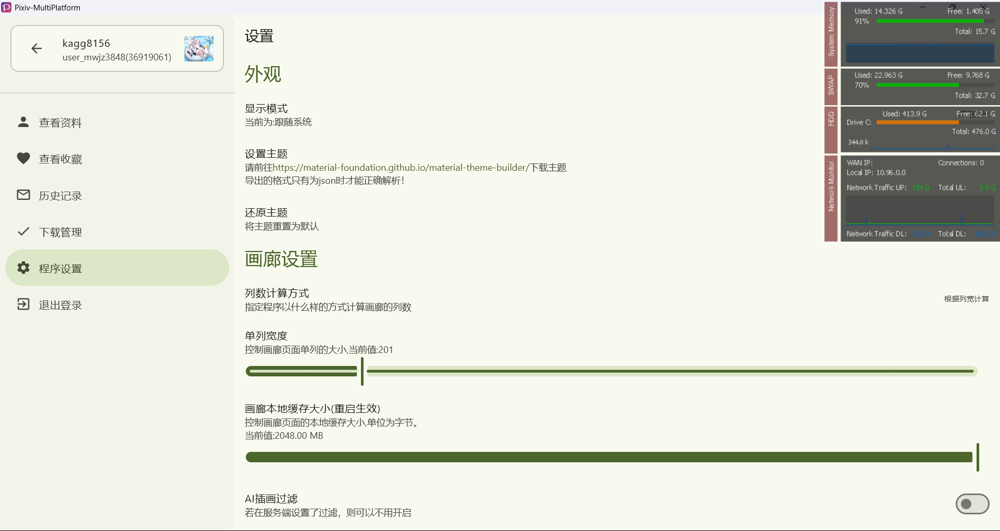

# 主题

## 日夜模式的主题切换

Pixiv-MultiPlatform支持跟随系统显示夜间模式。

## 自定义主题

1. 打开[Material Theme Builder](https://material-foundation.github.io/material-theme-builder/)

   

2. 配置喜好的颜色
   

3. 点击右下角`Pick your fonts`后直接点击`Export theme`

   

4. 导出类型要选择`Material Theme(JSON)`

   

5. 导出成功后，打开软件设置，点击导入主题。

   

6. 随后，主题就切换成功啦