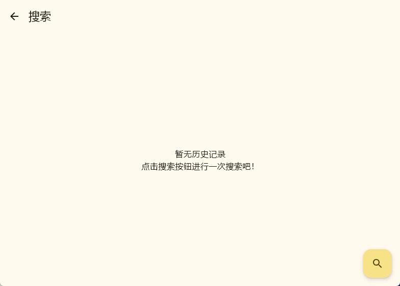
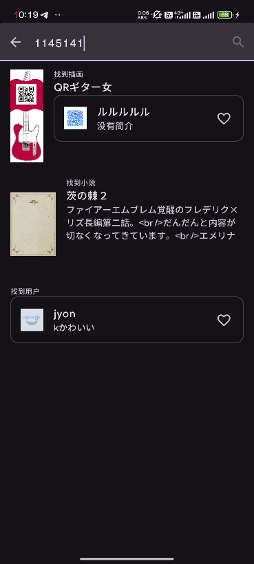

# 搜索

## 如何开始搜索

点击主页中左上角(**安卓端为右上角**)的放大镜图标进入搜索页面。

| Desktop                                                                                            | Phone                                                                                              |
| -------------------------------------------------------------------------------------------------- | -------------------------------------------------------------------------------------------------- |
|  |  |

> 左侧为无历史记录的页面，右侧为有历史记录的页面。
> 
> 点击垃圾桶图标可以删除。而点击条目可以前往TAG选择页面。

点击右下角放大镜，开始正式的搜索。

## 搜索页面

### 排序方式

可以以时间降序，时间升序，热度降序三种方式进行搜索。

::: tip

非Pixiv高级会员的热度降序仅会返回部分结果。

部分情况不支持以这些方式进行搜索。此时设置它的效果无效

:::

### 搜索模式

一共提供了5种搜索模式。

前两种搜索模式**强制**要求以TAG为单位搜索。

后三者搜索模式不会弹出tag选择页面。

含括号的选项代表该搜索模式将只能搜索括号内指定的选项。例如：

`关键词`搜索模式仅支持搜索小说。

### 热门tag

热门tag将会在进入页面时加载。点击这些tag会直接将tag填充到上面的选择框中。

::: warning

当你单击tag时，会自动将搜索模式改为：**匹配精确tag**

:::

## 关键词检索TAG

在输入框内输入关键词以进行搜索。例如：

::: tip

部分TAG会有对应的中文名字。点击这些tag填充的依然是英文关键词。

:::

点击tag后，tag将会填充到上面的输入框中。而点击tag右侧的x即可移除tag。

## 特殊搜索

我们支持纯数字搜索`插画/小说(系列)/作者`链接。只需要在输入框里粘贴对应id即可。

只需要从搜索结果里找到你喜欢的结果并点击即可！

